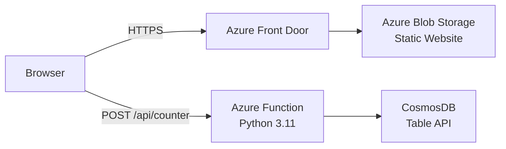

# Cloud Resume Challenge - Azure

A serverless resume site built on Azure as part of the [Cloud Resume Challenge](https://cloudresumechallenge.dev/docs/the-challenge/azure/). The site is a static HTML resume hosted on Azure Blob Storage, served through Azure Front Door with a custom domain and HTTPS, and includes a visitor counter powered by an Azure Function and CosmosDB.

## Architecture

**Frontend:** HTML, CSS, and vanilla JavaScript hosted as a static site in Azure Blob Storage. Azure Front Door provides CDN, custom domain (`cloudresume.n0csw.com`), and managed HTTPS.

**Backend:** A Python Azure Function that reads and increments a visitor count stored in CosmosDB (Table API, serverless). The function returns JSON and sets CORS headers for the frontend origin.

**Infrastructure:** All Azure resources are defined in an ARM template and deployed through GitHub Actions. No manual provisioning needed after initial setup.

**CI/CD:** Two GitHub Actions workflows handle deployment. The frontend workflow uploads static files to blob storage and purges the CDN cache. The backend workflow runs Python tests, deploys the ARM template, and publishes the function app.

## Reflection

For a deeper writeup on what I learned building this, see the [reflection page](https://cloudresume.n0csw.com/reflection/).

## Repos

- **Frontend** (this repo): Static HTML/CSS/JS, GitHub Actions for blob upload and CDN purge
- **Backend** ([cloudresume-backend](https://github.com/cswilsnetex/cloudresume-backend)): Python Azure Function, ARM templates, tests, GitHub Actions for infrastructure and function deployment (included as a git submodule)
